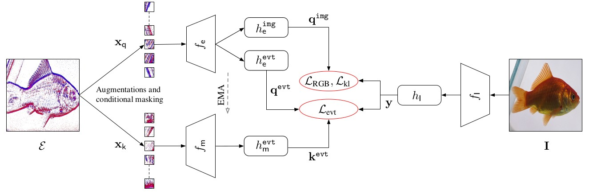

## Event Camera Data Pre-training<br><sub>Official PyTorch Implementation of the ICCV 2023 Paper</sub><br><sub>[Paper](doc/paper.pdf) | [Supp](doc/supp.pdf) </sub><br>

<p align="left">
    
  <br>
</p>

## Getting Started

#### 1. Dependency
* python 3.8.13
* numpy 1.24.1
* torch 1.11.0
* torchvision 0.10.1
* pytorch_lightning 1.6.4
* einops 0.4.0
* clip
* timm 0.9.2
* pyyaml 6.0
* flatten_dict 0.4.2
* torch_scatter 2.0.9


#### 2. Datasets
* [N-ImageNet dataset](https://github.com/82magnolia/n_imagenet). Please follow [here](https://github.com/82magnolia/n_imagenet) for downloading and organizing the dataset. The expected file sturctures are shown below. 
```
└───N_Imagenet
    └───/extracted_train/n******/***.npz
    │
    └───/extracted_val/n******/***.npz
```
* [ImageNet dataset](https://www.image-net.org/). After obtaining the dataset, please follow [here](https://gist.github.com/bonlime/4e0d236cf98cd5b15d977dfa03a63643) to extract the dataset. The expected file sturctures are shown below. 
```
 ___/train/n******/***.JPEG
│
└───/val/n******/***.JPEG
```


#### 3. Pre-training
- extract clip features by 
```
python3 extract_clip_feature.py --batch 128 --source_dir #where you store ImageNet --save_dir #where you store the CLIP features
```
- download a MoCoV3 [checkpoint](https://dl.fbaipublicfiles.com/moco-v3/vit-s-300ep/vit-s-300ep.pth.tar) pre-trained on ImageNet to slighly improve the model performance, and store it in `./checkpoints/` folder.
- Change path for files in `config` folder accordingly.
- Run the following code:

```
python3 train_bert.py --opt config/ours/pr_vits.yml --gpus 4 --num_nodes 4

``` 

#### 4. Linear probing / Fine-tuing
- Change path for files in `config` folder accordingly.
- Perform learn probing before fune-tuning will shorten the training epochs and usually improve the model performance.
- Run the following code:

```
python3 train_bert.py --opt config/ours/lr_vits.yml --gpus 4 --num_nodes 4
python3 train_bert.py --opt config/ours/ft_vits.yml --gpus 4 --num_nodes 4
``` 

## Pre-trained models
Find pre-trained models [here](https://drive.google.com/drive/folders/1EaOekjU66dxOYWRvqjhXyiPC1Ni2cVj8?usp=sharing).

## Contact
If you have any questions,  please drop [me](mailto:yan.yang@anu.edu.au?subject=[GitHub]EventCameraDataPre-training) an email.

## Acknowledgement
Most of the code is borrowed from:
* https://github.com/82magnolia/n_imagenet
* https://github.com/swz30/Restormer/tree/main
* https://github.com/facebookresearch/moco-v3
* https://github.com/facebookresearch/mae
* https://github.com/TimoStoff/event_utils

## Citation
If you find this code useful, please consider citing:

```
@article{Yang_2023,
  author       = {Yan Yang and
                  Liyuan Pan and
                  Liu Liu},
  title        = {Event Camera Data Pre-training},
  journal      = {CoRR},
  volume       = {abs/2301.01928},
  year         = {2023},
  url          = {https://doi.org/10.48550/arXiv.2301.01928},
  doi          = {10.48550/arXiv.2301.01928},
  eprinttype    = {arXiv},
  eprint       = {2301.01928},
}
```
